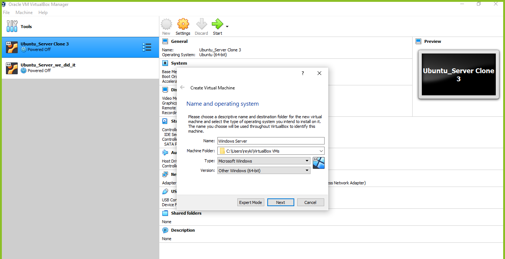
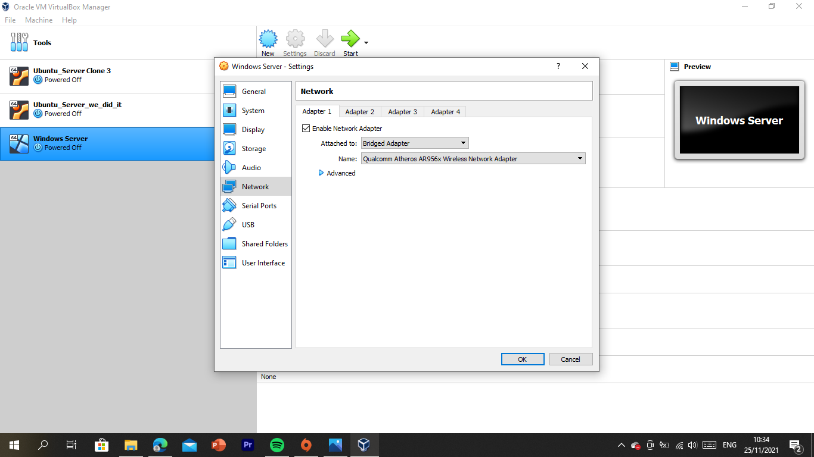

# UTS

**Gede Reyki Astika   1202190052 **

------

### Soal

### 1.Download ISO Installer windows server 2022 

a. https://www.microsoft.com/en-us/evalcenter/evaluate-windows-server-2022

### 2. Buat sebuah dokumentasi instalasi di github yang berisi

a. Instalasi windows server 2022

b. Instalasi Active Directory Domain Services

c. Instalasi DNS server

d. Instalasi Net Framework 3.5

e. Promote Server to a Domain Controller

------

### Step by Step

1. Download file iso windows server di link yang telah diberikan 

    https://www.microsoft.com/en-us/evalcenter/evaluate-windows-server-2022

   

   2. Install Windows Server

      

      

      install windows server di oracle vm dengan create virtual machine

      

      Masukan file iso yang telah didownload di link yang telah diberikan

      

      Memulai proses instalasi windows server 2022

      

      

      Memilih versi windows server yang digunakan yang dimana pada instalasi kali ini menggunakan windows server 2022 standard evaluation

      

      

      untuk penginstalan nya disini saya memilih untuk custom: install server operating system only

      

      pembagian partisi yang digunakan yang dimana disini menggunakan 20 gb dengan satu drive saja

      

      

      memulai proses penginstalan windows server 2022

      

      Masukan password yang diinginkan jangn lupa untuk forma password harus berisi : huruf kapital, huruf kecil dan angka

      

      Tampilan ui windows server 2022

      

------

### Menginstall roles dan features

Mengatur adapter network yang dimana dari nat menjadi bridge adapter

Mengubah ip dari dhcp menjadi static yang dimana saya menggunakan ip 192.168.43.12, untuk cara mengubah ip dengan cara, menuju network and internet lalu ke network connection masuk kedalam ethernet status lalu properties, cari internet protocol version 4.

ip berhasil berubah, untuk mengcek ip bisa melalui, win + r lalu ketik cmd dan ketik ipconfig

menambahkan roles dan features dengan mengklik add roles and features

------

### Answer of the Analysis

1. Because php5.6 is already at the end of service which doesn't support the latest updates, so we use Debian 9, which is still operating
2. Because LXC Virtualization is easy to use (lightweight), it can happen because it shares the host system's kernel. Users can easily create and manage system or application containers with a powerful API and simple tools.
3. Proxy server is a gateway provider between users and the internet. Proxy server is a server, referred to as a bridge between end-users and the web pages they visit online. A proxy server is basically a computer on the internet that has an IP address of its own. We think vm.local is the same as proxy server if the vm.local has the correct IP so that it can communicate with the local machines and the internet. In order to use the VM as a proxy server it just has to be connected to the correct networks.

